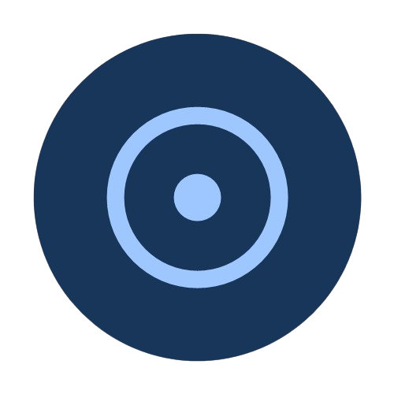

# 🚀 DropNet — Production-Grade Local Peer-to-Peer File & Text Sharing

<p align="center">
  
</p>

<h3 align="center">DropNet</h3>

<p align="center">
  <strong>Blazing fast, zero-trust local peer-to-peer file & text streaming designed with a highly responsive, glassmorphic Material 3 interface.</strong>
</p>

<p align="center">
  
  
  
  
  
  
</p>

---

## 🎯 Recruiter & Tech-Lead TL;DR

**DropNet** is a high-performance cross-platform local sharing utility built to showcase production-grade application architecture and network engineering. Instead of relying on centralized cloud endpoints, DropNet establishes direct, secure socket pipes over local local area networks (LANs). 

### 🏆 Engineering Highlights:
*   **Zero-Trust Security Model:** Cryptographically secured peer-to-peer handshakes with local self-signed TLS certificates (2048-bit RSA) and strict SHA-256 fingerprint pinning to prevent Man-in-the-Middle (MITM) attacks.
*   **Dual-Discovery Subsystem:** Combines Multicast DNS (mDNS) via Bonsoir with a high-availability UDP Datagram Broadcast socket (`255.255.255.255:45454`) to guarantee bulletproof discoverability across sandboxed runtimes (e.g., Windows firewalls).
*   **High-Throughput Streaming Engine:** High-performance, flow-controlled TCP Socket streams using dynamic 64KB chunk-level byte buffering and isolated event offloading.
*   **Embedded Micro-Web Server:** Built-in `shelf`-powered web portal with dynamic HTML injection, secure cookie-based PIN gates (`wsid` session tracking), and dynamic QR pairing, enabling zero-install file uploads/downloads for guest platforms (such as iOS/Desktop).
*   **Clean Architecture (SOLID):** Highly decoupled, testable structure utilizing **Riverpod** for reactive, compile-safe state machines and dynamic theme seeding.

---

## 📖 Project Overview & Rationale

When transferring files between devices in close proximity, modern consumers are faced with a trade-off: upload files to cloud servers (wasting bandwidth, latency, and compromising privacy) or struggle with proprietary platforms (AirDrop, Quick Share) that don't natively interoperate with Windows, Linux, or iOS.

DropNet solves this by operating as a **purely local utility** that requires zero cloud configurations, cellular data, or account creation. Rendering a premium tactile experience at 60/120fps across all screens, DropNet demonstrates that consumer-grade software can achieve near-zero-latency data delivery without sacrificing aesthetic elegance or security standards.

---

## 🛠 Architectural Tech Stack & Rationale

DropNet’s tech stack is carefully curated to achieve optimal speed, UI response, and strict type safety:

| Technology | Architectural Role | Technical Justification |
| :--- | :--- | :--- |
| **Flutter SDK** | Cross-Platform UI Rendering | Compiled natively to ARM64/x86 machinery via Flutter’s Impeller/Skia engine, guaranteeing smooth transitions, complex canvas paints, and single-codebase UI parity. |
| **Dart Runtime** | Non-blocking Socket I/O | Out-of-the-box support for Event-Driven loops, non-blocking asynchronous socket streams, and Ahead-of-Time (AOT) machine compilation. |
| **Riverpod** | Uni-directional State Engine | Ensures compile-safe state graphs, fully decoupling data models, platform MethodChannels, and local databases from reactive widgets. |
| **mDNS & UDP Sockets** | Peer Discovery Daemon | Multicast DNS (RFC 6762) over multicast address `224.0.0.251:5353` combined with fallback UDP socket broadcasts guarantees robust discovery on all local topologies. |
| **Secure TCP Sockets** | Encrypted Transport Layer | Implements raw Point-to-Point TCP Sockets wrapped in **TLS 1.3** (`SecureSocket`) to ensure reliable, in-order, error-checked data pipelines. |
| **Shelf (Dart)** | Embedded Web Portal | A lightweight, composable middleware HTTP server pipeline that transforms the host device into a localized fileshare portal for external devices. |

---

## 🎓 Computer Science Undergrad Fundamentals Explained

DropNet is a practical sandbox representing core CS engineering principles in a consumer-ready mobile/desktop application:

### 1. Computer Networks (OSI Transport & Network Layers)
DropNet uses the socket API to establish two distinct networking layers:
*   **Discovery (UDP / Connectionless):** Devices broadcast structured presence JSON payloads containing ephemeral cryptographic nonces, CPU architectures, dynamic pairing states, and public key fingerprints over port `45454` using UDP Broadcast (`255.255.255.255`). Simultaneously, a multicast group listener scans port `5353` (mDNS) to resolve PTR/SRV/TXT records. A dedicated daemon prunes idle records if no packet is received for 12 seconds.
*   **Data Delivery (TCP / Connection-Oriented):** Once transfers are initiated, the app spins up a raw `SecureServerSocket` on port `45455`. Raw TCP sockets utilize standard sliding window flow control to prevent buffer exhaustion.
*   **Custom Framing Protocol:** Raw socket buffers are written using a custom binary frame format:
    ```
    ┌─────────────────────────┬─────────────────────────┬─────────────────────────┬─────────────────────────┐
    │  Frame Length (4 Bytes) │     IV (16 Bytes)       │  SHA-256 Hash (32 Bytes)│ Ciphertext (Variable)   │
    │  (Big-Endian uint32)    │   (AES Initial Vector)  │   (Plaintext Integrity) │  (Encrypted Payload)    │
    └─────────────────────────┴─────────────────────────┴─────────────────────────┴─────────────────────────┘
    ```
    This framing solves TCP socket stream fragmentation, ensuring the receiving socket reads exact segment boundaries before attempting AES decryption.

### 2. Operating Systems (Concurrency & Event-Driven I/O)
Dart operates on a single-threaded **Event Loop** architecture. Performing high-speed multi-gigabyte networking on the main isolate would starve the graphics pipeline, causing massive UI frame dropping (jank).
*   **Asynchronous I/O:** Socket streams (`Socket` and `ServerSocket`) are non-blocking, driven by low-level OS multiplexers (like `epoll` on Linux/Android and `kqueue` on iOS/macOS).
*   **Background Multi-Threaded Isolates:** Heavy computations—such as dynamic ZIP generation, calculating file checksums (SHA-256), and high-frequency disk writes—are spawned in dedicated Dart **Isolates**. Isolates are isolated OS-level threads with independent memory heaps. By communicating via message passing (`SendPort`/`ReceivePort`), the main thread's UI thread is kept entirely free, ensuring constant fluid animations.

### 3. Cryptography & Cybersecurity (Zero-Trust Security Model)
To completely prevent LAN eavesdropping or malicious client spoofing, DropNet implements an advanced trust model:
*   **TLS on LAN:** On startup, `LocalTlsCertificateService` generates an ephemeral 2048-bit RSA key pair and a self-signed X.509 certificate specifying standard Subject Alternative Names (SANs) dynamically mapped to current active local adapter IPs.
*   **Strict Fingerprint Pinning:** During the mDNS/UDP discovery phase, peers advertise the SHA-256 fingerprint of their local X.509 certificate. When a socket connection is formed, the connection intercepts the handshakes (`onBadCertificate` callback) and programmatically verifies the peer's actual public key against the advertised fingerprint. Connections with a mismatched fingerprint are terminated instantly.
*   **Zero-Trust Pairing Codes:** Direct pairings mandate a 6-digit cryptographic verification code. This code forms a dynamic shared secret. Payloads are encrypted with **AES-CBC-256** using an ephemeral session key wrapped securely and transmitted via the TLS-secured socket.

### 4. Deterministic State Machines
State changes follow a rigorous, mathematical state machine. Decoupled from visual render trees, it prevents race conditions (e.g., trying to write to a closed socket):

```
       ┌───────────────┐
       │     Idle      │
       └───────┬───────┘
               │ Discovery Triggered
               ▼
       ┌───────────────┐
       │  Connecting   │
       └───────┬───────┘
               │ Handshake & Fingerprint Match
               ▼
       ┌───────────────┐
       │    Pairing    │ <──────── (Pairing Code & Secret Verification)
       └───────┬───────┘
               │ Handshake Accepted
               ▼
       ┌───────────────┐
       │    Active     │ <──────── (Chunked flow-controlled byte streams)
       └───────┬───────┘
               ├─────────────────────────┐
               ▼ (Payload OK & Verified)   ▼ (Timeout / Integrity Fail / Cancel)
       ┌───────────────┐         ┌───────────────┐
       │   Completed   │         │    Failed     │
       └───────────────┘         └───────────────┘
               │                         │
               └───────────┬─────────────┘
                           ▼
               ┌───────────────────────┐
               │ Socket GC & Cleanup   │ (Sockets closed, files closed, memory freed)
               └───────────────────────┘
```

---

## 🌟 Premium Application Features

*   **Fluid Sonar Pulse Radar:** A custom-painted concentric scanning sonar visualizer with rotating vector lines simulating active LAN scanning. Features a dynamic green pulsing badge indicating "Ready to Receive".
*   **Device Identity Panel:** A gorgeous glassmorphic card displaying the active platform OS (Android, iOS, Windows, etc.), custom numeric tag, device name, **Device Manufacturer** details, and the active **Local IP Address** for easy LAN diagnostic checks.
*   **Zero-Trust Pairing System:** Offers pairing-code connection verification to establish cryptographic fingerprints between devices, ensuring absolute immunity to local man-in-the-middle attacks.
*   **Floating Transfer Queue Card:** A prominent, glowing, color-shifting banner that slides into view at the top of the Receive screen when files are waiting in the queue, providing tactile feedback.
*   **shelf-Powered Web Share Portal:** Run a micro-web server from your device, display a custom QR code, and allow friends to securely download or upload files through any browser.
*   **Granular Quick Save Modes:** Toggle between three security postures: *High Security* (manual approval for all transfers), *Trusted Auto-Save* (auto-save for favorited devices), or *Open Auto-Save* (auto-save for everyone) accompanied by interactive security explanation panels.
*   **CPU ABI & Compilation Target Diagnostics (Android):** Inspects the native APK container at runtime, analyzing whether the installed executable is running as an ABI-specific split target (e.g. `arm-v8a`, `arm-v7a`) or a unified `universal` binary.

---

## 📂 Codebase Architecture & Navigation

DropNet is built upon **Clean Architecture** principles, enforcing a strict separation of concerns:

```
lib/
├── core/
│   ├── encryption/      # AES-256 chunk-level encryption, IV generation, key-wrapping
│   ├── networking/      # Socket Services, Web Shelf Servers, Discovery Engines
│   ├── platform/        # Native MethodChannels, MediaStore APIs, SAF filesystems
│   ├── security/        # 2048-bit RSA self-signed TLS generation, certificate validation
│   ├── state/           # AppState structures and Riverpod state controllers
│   └── utils/           # Platform normalizers, dialog generators, theme seeding
├── features/
│   ├── analytics/       # Storage analytics and historical transfer speeds
│   ├── history/         # Transfer logs database (history listings)
│   ├── home/            # Core shell containing navigation scaffolding
│   ├── onboarding/      # Welcome flow and OS runtime permission handshakes
│   ├── receive/         # Redesigned animated sonar, local IP displays, incoming queue
│   ├── send/            # Discovered devices radar, multi-file payload buffers
│   ├── settings/        # Dynamic colors, quick save modes, CPU ABI footer
│   └── web_mode/        # Shelf micro-server console & QR dialogs
├── models/              # Immutable data models representing peers, transfers, and system logs
└── widgets/             # High-fidelity shared widgets (Expressive dialogs, progress bars)
```

### 🔍 Key Implementation Files:
*   [tcp_transfer_service.dart](file:///d:/flutter_projects/dropnet/lib/core/networking/tcp_transfer_service.dart) - Handles all TLS sockets, dynamic file streaming, and chunk framing.
*   [discovery_service.dart](file:///d:/flutter_projects/dropnet/lib/core/networking/discovery_service.dart) - Manages UDP presence broadcasts and mDNS Bonsoir records.
*   [local_tls_certificate_service.dart](file:///d:/flutter_projects/dropnet/lib/core/security/local_tls_certificate_service.dart) - Generates self-signed certificates with dynamic Subject Alternative Names (SANs).
*   [web_server_service.dart](file:///d:/flutter_projects/dropnet/lib/core/networking/web_server_service.dart) - Houses the embedded web share server and PIN/cookie authorization.
*   [app_state.dart](file:///d:/flutter_projects/dropnet/lib/core/state/app_state.dart) - Unified Riverpod notifier orchestrating the core lifecycle.
*   [settings_screen.dart](file:///d:/flutter_projects/dropnet/lib/features/settings/settings_screen.dart) - Features settings, Quick Save modes, and native CPU ABI details.
*   [receive_screen.dart](file:///d:/flutter_projects/dropnet/lib/features/receive/receive_screen.dart) - Contains the redesigned sonar pulse, manufacturer details, and local IP diagnostics.
*   [MainActivity.kt](file:///d:/flutter_projects/dropnet/android/app/src/main/kotlin/com/dropnet/MainActivity.kt) - Houses the native Kotlin Platform MethodChannel to detect target architecture APK builds.

---

## 📦 Getting Started & Build Instructions

### Prerequisites
*   [Flutter SDK](https://docs.flutter.dev/get-started/install) (v3.19.0 or higher)
*   [Dart SDK](https://dart.dev/get-started) (v3.10.0 or higher)
*   An Android Device / Emulator (API Level 21+) or iOS / Windows / macOS / Linux target.

### 1. Clone the Repository
```bash
git clone https://github.com/arijeetdas/dropnet.git
cd dropnet
```

### 2. Fetch Dependencies
```bash
flutter pub get
```

### 3. Run Static Code Quality Check
Ensure the codebase remains warning and error-free:
```bash
flutter analyze
```

### 4. Run the Application locally
```bash
# Launches the app on your connected device
flutter run
```

### 5. Compile Build Artifacts
Compile high-performance production binaries:
```bash
# Build a universal release APK containing all ABIs
flutter build apk --release

# Build split APKS (individually packaged for arm64-v8a, armeabi-v7a, x86_64)
flutter build apk --split-per-abi --release
```

---

## 🤝 Contributing Guidelines

DropNet is open-source, and contributions are highly appreciated! Here is how you can help:

### 🐛 Reporting Issues & Requests
1. Navigate to the **Issues** tab.
2. Search past issues to avoid duplicates.
3. Click **New Issue**, select a template, and provide absolute clarity. For bugs, include log outputs and OS specifications. For enhancements, include system topologies or design mocks.

### 💻 Pull Request Workflow
1. **Fork** the repository and create a descriptive branch:
   ```bash
   git checkout -b feature/AmazingNewFeature
   ```
2. Commit your changes using standard conventional commit formats:
   ```bash
   git commit -m "feat: implement dynamic peer encryption handshakes"
   ```
3. Push to your fork:
   ```bash
   git push origin feature/AmazingNewFeature
   ```
4. Open a **Pull Request** targeting the `main` branch. 
5. Ensure the PR passes `flutter analyze` and builds successfully on target platforms before requesting review.

---

## 🛡 License

This project is licensed under the terms of the **MIT License**. See [LICENSE](file:///d:/flutter_projects/dropnet/LICENSE) for more details.

---

## 👤 Developer & Contact

**Arijeet Das**  
*Computer Science & Engineering Undergraduate*

*   **GitHub:** [@arijeetdas](https://github.com/arijeetdas)
*   **LinkedIn:** [Arijeet Das](https://linkedin.com/in/arijeetdas)
*   **Email:** arijeetdas04@gmail.com

---
*DropNet represents a meticulous effort to bridge low-level networking, cryptography, and concurrent systems design with dynamic, highly polished consumer-ready Material Design frameworks.*
